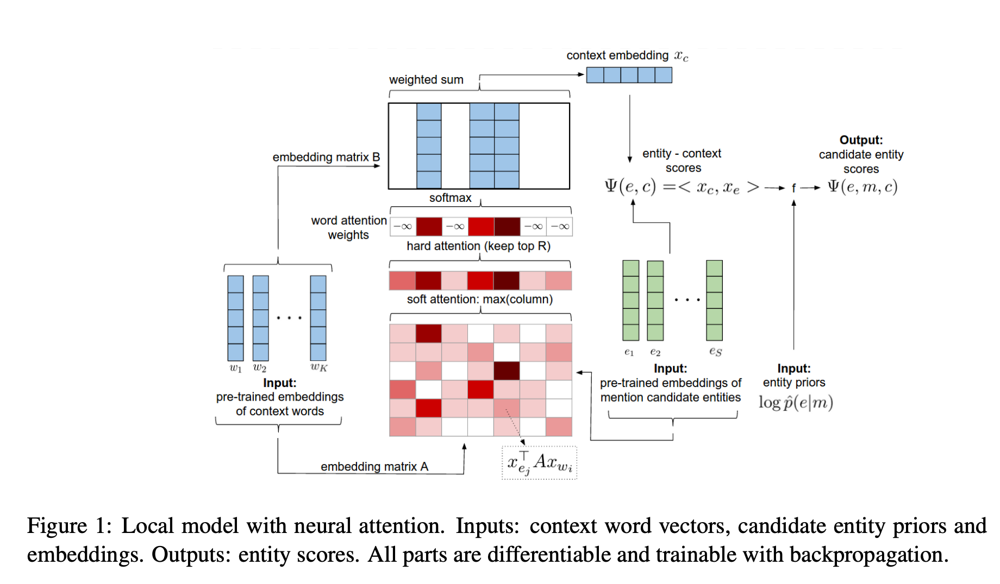

# PyTorch Implementation of "Deep Joint Entity Disambiguation with Local Neural Attention"

This is a PyTorch implementation of deep-ed https://arxiv.org/abs/1704.04920, original code is at https://github.com/dalab/deep-ed




This implementation has almost exactly the same data pre-processing and post-processing flow as original implementation 
in torch with lua.


## Install
1) install necessary package
```bash
$ git clone https://github.com/yifding/deep_ed_PyTorch.git
$ cd /path/to/deep_ed_PyTorch
$ pip install -r requirements.txt 
$ pip install --editable . 
```

2) Download data files needed for training and testing from [this link](https://drive.google.com/uc?id=0Bx8d3azIm_ZcbHMtVmRVc1o5TWM&export=download).
 Download basic_data.zip, unzip it and place the basic_data directory in **ROOT_DATA_DIR=deep_ed_PyTorch/data/**. All generated files will be build based on files in this basic_data/ directory.

3) Download pre-trained Word2Vec vectors GoogleNews-vectors-negative300.bin.gz from page https://code.google.com/archive/p/word2vec/,
actual link is at https://drive.google.com/file/d/0B7XkCwpI5KDYNlNUTTlSS21pQmM/edit?usp=sharing.
Unzip it and place the bin file in the folder deep_ed_PyTorch/data/basic_data/wordEmbeddings/Word2Vec.


## step1. create wikipedia_p_e_m
#### Input: **basic_data/textWithAnchorsFromAllWikipedia2014Feb.txt**
#### Output: **generated/wikipedia_p_e_m.txt**

execute:
```
python deep_ed_PyTorch/data_gen/gen_p_e_m/gen_p_e_m_from_wiki.py --root_data_dir
```

using class from (debug included)
```
deep_ed_PyTorch/data_gen/parse_wiki_dump/parse_wiki_dump_tools.py --root_data_dir
```

## step2. Merge wikipedia_p_e_m.txt and crosswikis_p_e_m.txt
#### Input: **generated/wikipedia_p_e_m.txt**, **basic_data/p_e_m_data/crosswikis_p_e_m.txt**
#### Output: **generated/crosswikis_wikipedia_p_e_m.txt**

execute:
```
python deep_ed/PyTorch/data_gen/gen_p_e_m/merge_crosswikis_wiki.py --root_data_dir
```

using class **EntNameID** from (debug included):
```
deep_ed_PyTorch/entities/ent_name2id_freq/ent_name_id.py 
```
load data from **basic_data/wiki_name_id_map.txt**

## step3. Create yago_p_e_m.txt
#### Input: **basic_data/p_e_m_data/aida_means.tsv**, **basic_data/wiki_redirects.txt**, 
#### Output: **generated/yago_p_e_m.txt**

execute:
```
python deep_ed/PyTorch/data_gen/gen_p_e_m/gen_p_e_m_from_yago.py --root_data_dir
```
using
```
from deep_ed_PyTorch.data_gen.gen_p_e_m import UnicodeMap
from deep_ed_PyTorch.entities.ent_name2id_freq import EntNameID
```

## step4. Create a file ent_wiki_freq.txt with entity frequencies:
#### Input: **generated/crosswikis_wikipedia_p_e_m.txt**, 
#### Output: **generated/ent_wiki_freq.txt**

execute:
```
python deep_ed/PyTorch/entities/ent_name2id_freq/e_freq_gen.py --root_data_dir
```

## step5. Generate all entity disambiguation datasets in a CSV format needed in our training stage:

input directory under ```basic_data/test_datasets/wned-datasets```:
for example: **ace2004** dataset:
```
ace2004
| - RawText
|    | - document-1
|    | - document-2
|    | - ...
| - ace2004.xml

document-1, document-2 and ... are the document names specified by the ace2004.xml
```

#### Input: **basic_data/test_datasets/wned-datasets/NAME,**  **basic_data/test_datasets/AIDA/aida_train.txt** and **basic_data/test_datasets/AIDA/testa_testb_aggregate_original**   

#### Output: **generated/test_train_data/NAME.csv**, for each NAME in **basic_data/test_datasets/wned-datasets/.  **generated/test_train_data/aida_train.csv**, **generated/test_train_data/aida_testA.csv**, **generated/test_train_data/aida_testB.csv**

execute:

```
mkdir $DATA_PATH/generated/test_train_data/
python deep_ed_PyTorch/data_gen/gen_test_train_data/gen_test_train_data.py --root_data_dir
```

## step6. Create training data for learning entity embeddings:
### i) From Wiki canonical pages

#### Input: **basic_data/textWithAnchorsFromAllWikipedia2014Feb.txt**
#### Output: **generated/wiki_canonical_words.txt**, **generated/empty_page_ents.txt**

execute:

```
python deep_ed_PyTorch/data_gen/gen_wiki_data/gen_ent_wiki_w_repr.py   --root_data_dir
```


### ii) From context windows surrounding Wiki hyperlinks:

#### Input: **basic_data/textWithAnchorsFromAllWikipedia2014Feb.txt**, **data_gen/indexes/yago_crosswikis_wiki.lua**
#### Output: **generated/wiki_hyperlink_contexts.csv**

execute:

```
python deep_ed_PyTorch/data_gen/gen_wiki_data/gen_wiki_hyp_train_data.py   --root_data_dir
```

## step7. Compute the unigram frequency of each word in the Wikipedia corpus:
#### Input: **generated/wiki_canonical_words.txt**
#### Output: **generated/word_wiki_freq.txt**

execute:
```
python deep_ed_PyTorch/words/w_freq/w_freq_gen.py  --root_data_dir
```

## step8. Compute the restricted training data for learning entity embeddings by using only candidate entities from the relatedness datasets and all ED sets:
### i) From Wiki canonical pages
#### Input: **generated/wiki_canonical_words.txt**
#### Output: **generated/wiki_canonical_words_RLTD.txt**

execute:
```
python deep_ed_PyTorch/entities/relatedness/filter_wiki_canonical_words_RLTD.py --root_data_dir
```

### ii) From context windows surrounding Wiki hyperlinks:
#### Input: **generated/wiki_hyperlink_contexts.csv**
#### Output: **generated/wiki_hyperlink_contexts_RLTD.csv**

execute:
```
python deep_ed_PyTorch/entities/relatedness/filter_wiki_hyperlink_contexts_RLTD.py  --root_data_dir
```

## step9. train entity embedding with **RLTD** entity vocabulary.
### Output: **generated/ent_vecs/ent_vecs__ep_*.pt**

execute:
```
python3 deep_ed_PyTorch/entities/learn_e2v/learn_a.py --max_epoch 200 --root_data_dir ${DATA_PATH}
```

## train local ED model.
### Output: **generated/ent_vecs/ent_vecs__ep_*.pt**

execute:
```
python3 deep_ed_PyTorch/ed/train.py --model_type 'local' --max_epoch 200 --ent_vecs_filename 'ent_vecs__ep_231.pt' --root_data_dir ${DATA_PATH}
```

## evaluate local ED model.
execute:
```
python3 deep_ed_PyTorch/ed/test/test_one_loaded_model.py --model_type 'local' --test_one_model_file 'local_380.pt'
```

## train global ED model.
### Output: **generated/ent_vecs/ent_vecs__ep_*.pt**

execute:
```
python3 deep_ed_PyTorch/ed/train.py --model_type 'global' --max_epoch 200 --ent_vecs_filename 'ent_vecs__ep_231.pt' --root_data_dir ${DATA_PATH}
```

## evaluate local ED model.
execute:
```
python3 deep_ed_PyTorch/ed/test/test_one_loaded_model.py --model_type 'global' --type 'cpu' --test_one_model_file 'global_259.pt'

```


## basic_data directory:
- basic_data
    - textWithAnchorsFromALWikipedia2014Feb.txt:  wikipedia with hyperlink processed by WikiExtractor.py 
    - wiki_disambiguation_pages.txt:  disambiguation page 
    - wiki_redirect.txt:  redirect page 
    - wiki_name_id_map.txt:  name and wikiID map 
    - WikiExtractor.py    <br/>

    - p_e_m_data  <br/>
        - aida_mean.tsv:  Yago data 
        - crosswikis_p_e_m.txt:   Yago index
        - persons.txt:    person name 

    - relatedness
        - relatedness-assessment.txt: ??? 
        - test.svm 
        - validate.svm 
        
    - test_datasets:  EL test datasets
    
    - wordEmbeddings/Word2Vec/GoogleNews-vectors-negative300.bin:     word2vec pretrained word embedding  <br/>
